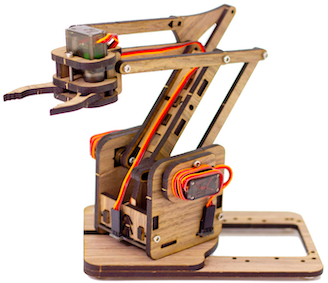

# Overview

This page meant to bring inspiration for desigining a robotic arm as final project for the FabZero course.

## Existing robotic arm projects

It is possible to find several projects of robotic arm on the internet.
Here I will list some I have found.

* [MeArm](https://mearm.com): Open source robot arm designed using small number of components.

* [How to Mechatronics](): This youtube channel offers two very nice ideas of robotic arm build using the concepts learned in the classes.
	* [Static arm](https://www.youtube.com/watch?v=_B3gWd3A_SI&t=316s): the arm is fixed in the ground and have 4 points of movements. It uses arduino to decide about the movements of the arm and smartphone app to request the arm to move. 
	* [Mobile arm](https://www.youtube.com/watch?v=LBNRGBY5zN8): It is the same "Static arm" but now integrated in a mobile vehicle. The mobile app has been changed because there was a problem of integrating some components with the arduino.

*
